# Binary Tree

## OBJECTIVES

- Define what a tree is
- Compare and contrast trees and lists
- Explain the differences between trees, binary trees, and binary search trees
- Implement operations on binary search trees

## WHAT IS A TREE?

A data structure that consists of nodes in a parent / child relationship

## TREE TERMINOLOGY

- Root - The top node in a tree.
- Child -A node directly connected to another node when moving - away from the Root.
- Parent - The converse notion of a child.
- Siblings -A group of nodes with the same parent.
- Leaf - A node with no children.
- Edge - The connection between one node and another.

## KINDS OF TREES

- Trees
- Binary Trees
- Binary Search Trees

## HOW BSTS WORK

- Every parent node has at most two children
- Every node to the left of a parent node is always less than the parent
- Every node to the right of a parent node is always greater than the parent

### Declaring Node class and binary tree/ BST class

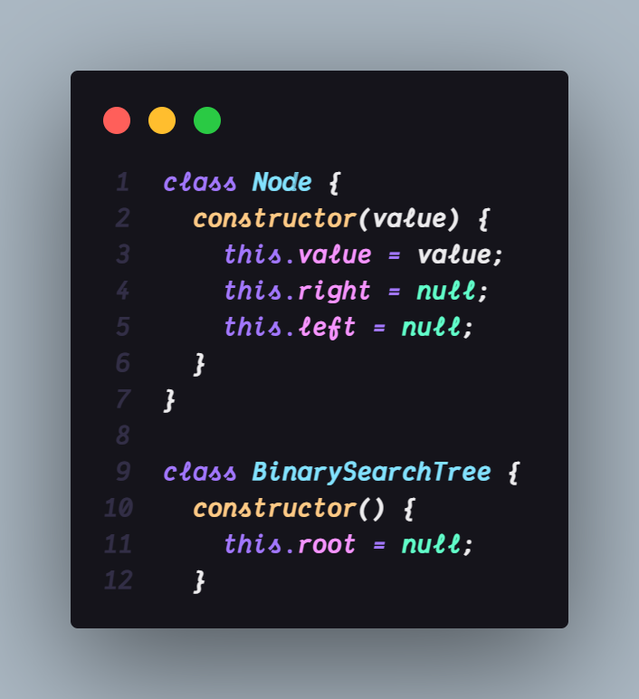

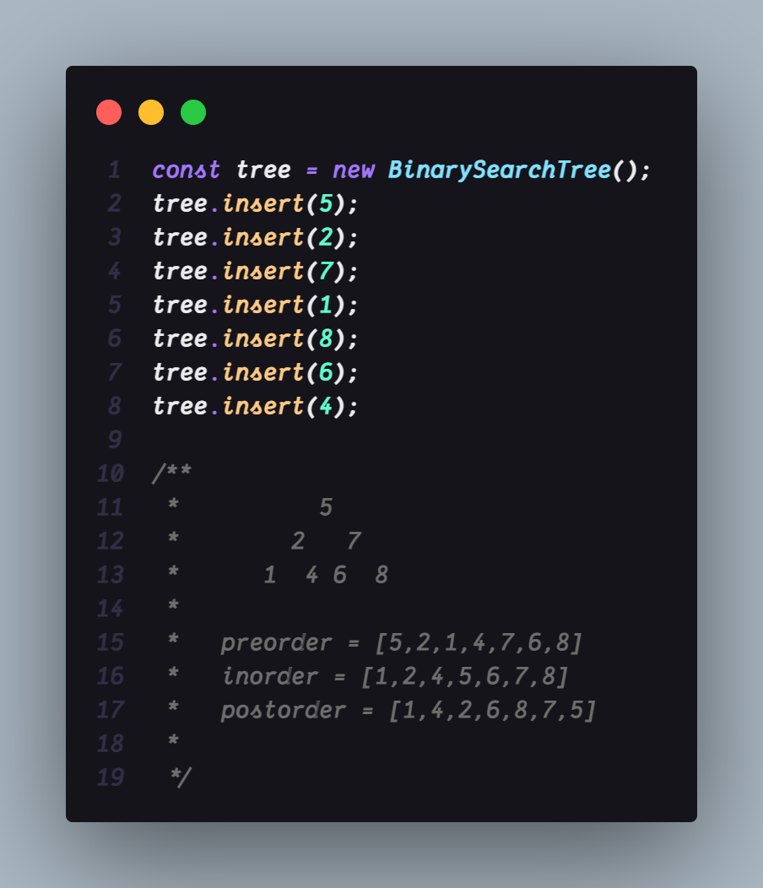

## INSERTING A NODE

### Pseudocode

- Create a new node
- Starting at the root
- Check if there is a root, if not - the root now becomes that new node!
- If there is a root, check if the value of the new node is greater than or - less than the value of the root
- If it is greater
- Check to see if there is a node to the right
- If there is, move to that node and repeat these steps
- If there is not, add that node as the right property
- If it is less
- Check to see if there is a node to the left
- If there is, move to that node and repeat these steps
- If there is not, add that node as the left property

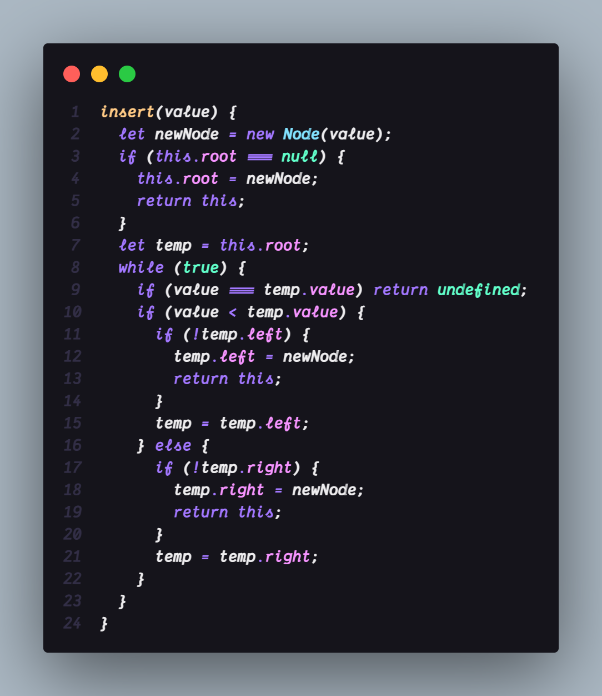

## Finding a Node in a BST

### Pseudocode

- Starting at the root
- Check if there is a root, if not - we're done searching!
- If there is a root, check if the value of the new node is the value we are - looking for. If we found it, we're done!
- If not, check to see if the value is greater than or less than the value of the root
- If it is greater
- Check to see if there is a node to the right
- If there is, move to that node and repeat these steps
- If there is not, we're done searching!
- If it is less
- Check to see if there is a node to the left
- If there is, move to that node and repeat these steps
- If there is not, we're done searching!

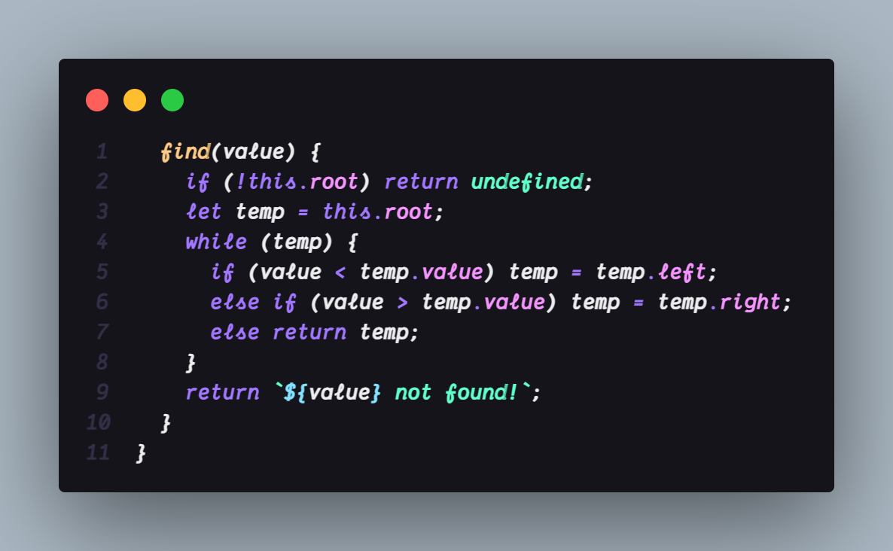

### Removing a Node in BST

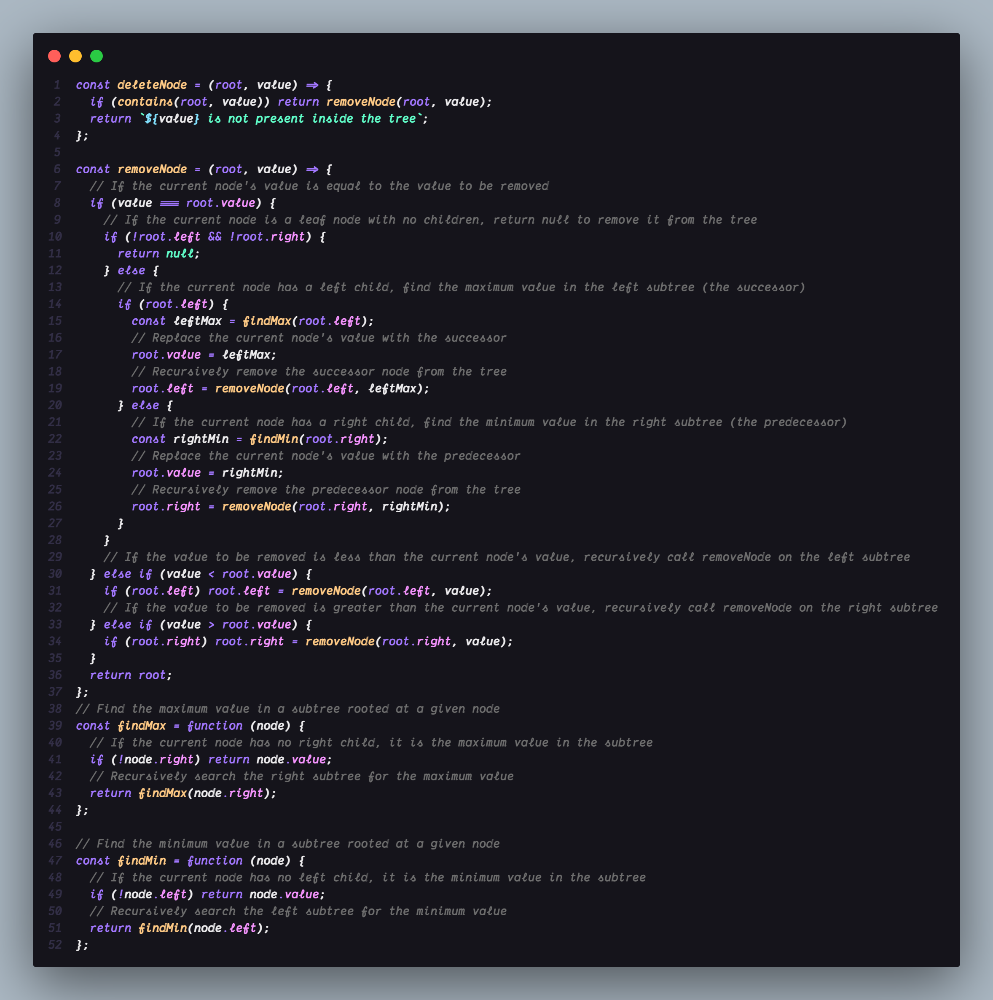

## Following are some methods of **Binary Tree**

### TRAVERSING A TREE

Two ways:

- Breadth-first Search (uses a queue)
- Depth-first Search (uses a stack)

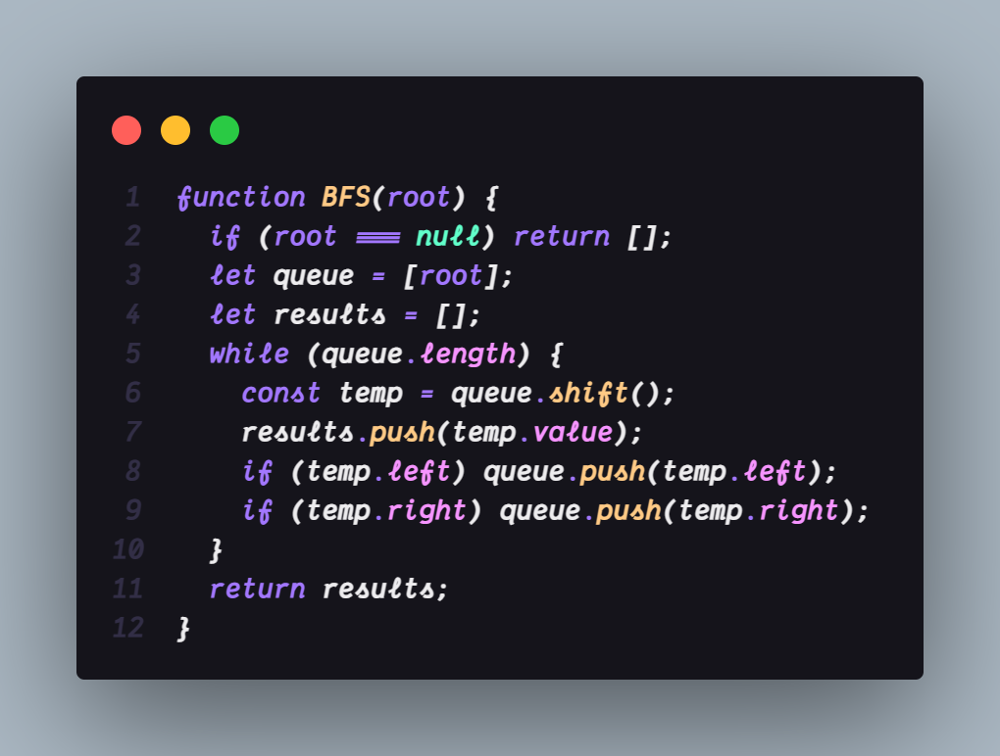

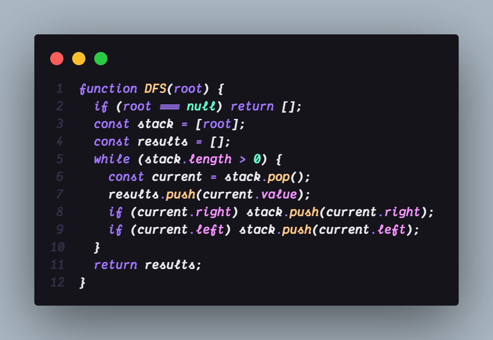

### PreOrder

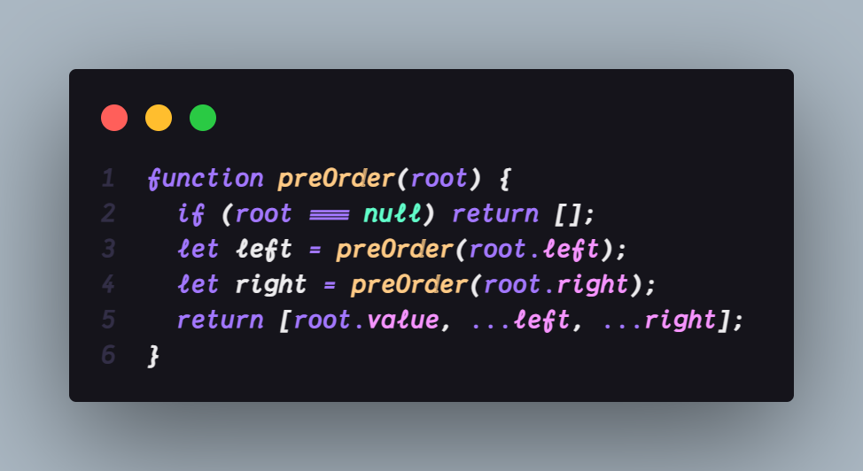

### InOrder

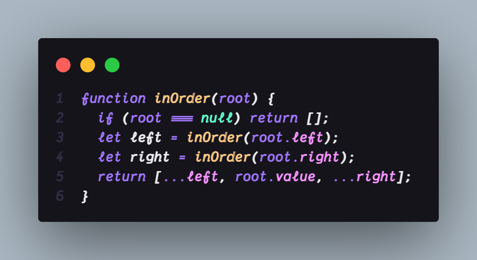

### PostOrder

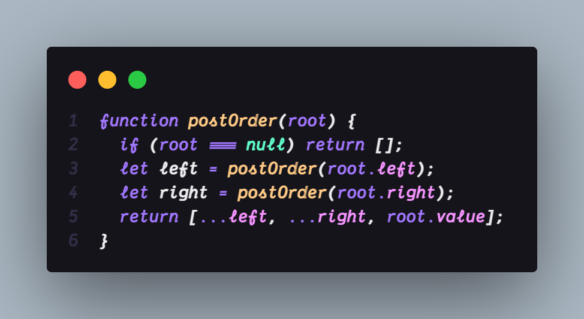

### Contains

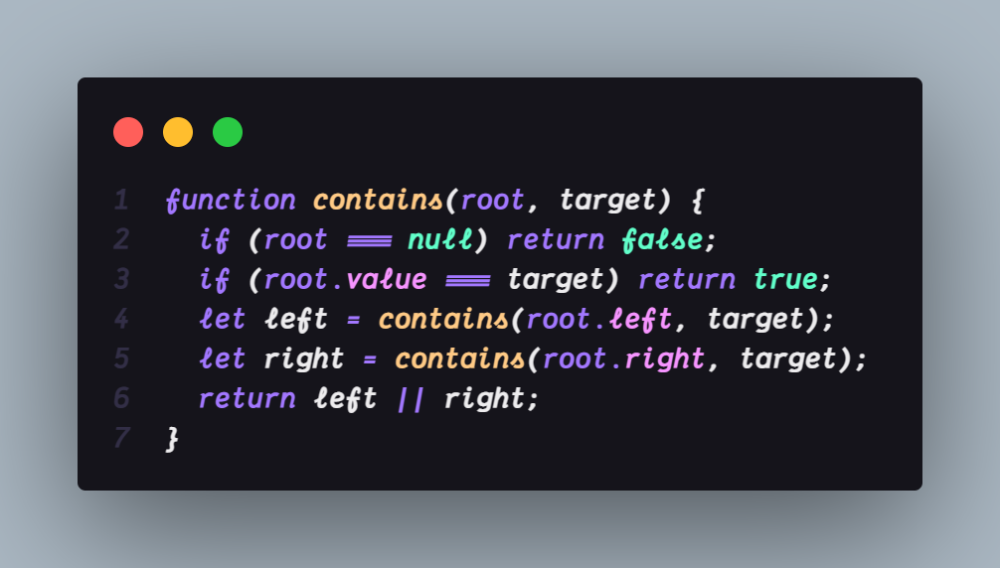

### LeafSum

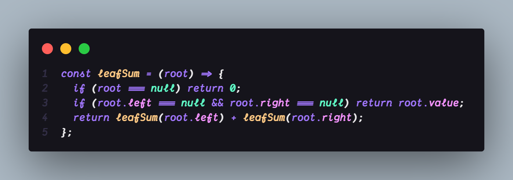

### MaxPathSum

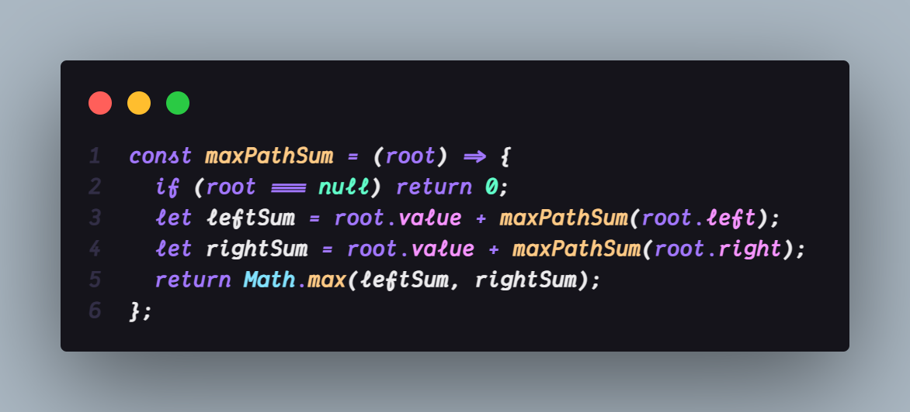
